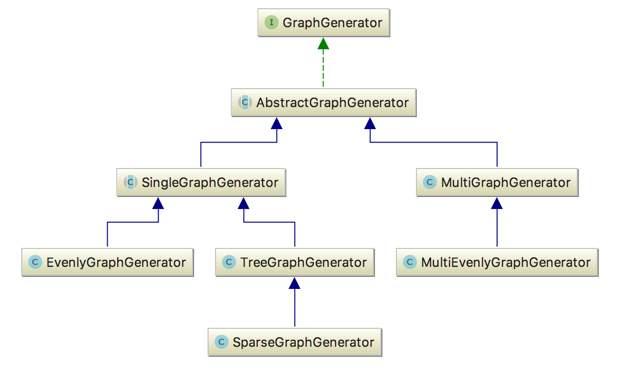

## drawG

定义图生成与图绘制API，并提供多种图生成器和图处理器，方便用户定制。

### 图生成器

图生成器用于生成各种结构的图，分为单图和多图两大类：
1. 单图生成器可以由用户定制扩展不同的图生成方式。
2. 多图生成器可以绑定一批单图生成器。



单图举例：

```java
public void draw() {
    GraphProcessor processor = ProcessorFactory.getDefaultProcessor();

    GraphGenerator generator = new EvenlyGraphGenerator(8, 3);

    processor.process(generator);
}
```

多图举例：

```java
public void draw() {
    GraphProcessor processor = ProcessorFactory.getDefaultProcessor();

    MultiGraphGenerator multiGraphGenerator = new MultiGraphGenerator();
    multiGraphGenerator.addGenerator(new EvenlyGraphGenerator(22, 3));
    multiGraphGenerator.addGenerator(new TreeGraphGenerator(3, 3, 2));
    multiGraphGenerator.addGenerator(new SparseGraphGenerator(3, 3, 2, 1));
    multiGraphGenerator.addGenerator(new EvenlyGraphGenerator(22, 20));

    processor.process(multiGraphGenerator);
}
```

### 图处理器

图处理器将图生成器的生成的图进行打印，绘制等。目前支持的图处理器有两种：

1. 一种是可以被 [Graph Builder](http://live.yworks.com/yfiles-for-html/2.0/databinding/graphbuilder/index.html)识别的图处理器。
2. 另一种是使用[vis.js](http://visjs.org)进行绘制的图处理器，该处理器绘制的图比较美观，因此是默认的图处理器。


绝对均匀多图举例：


树形图举例：


不分层倾斜图举例：


